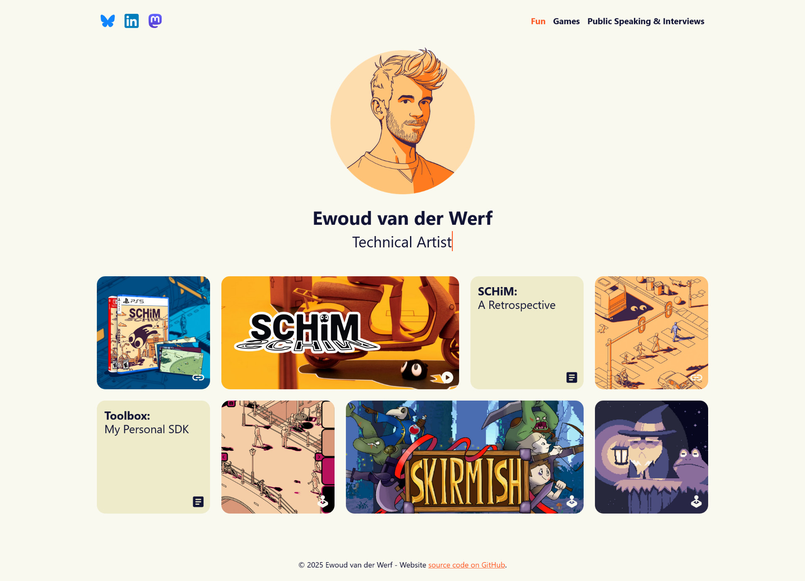
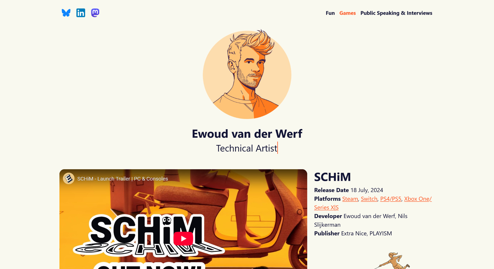

# ewoud.dev

Welcome to the repository for my personal website! This site showcases my skills, projects, and experiences. It serves as a central hub to highlight my work, background, and how to get in touch with me.

You can view the live website here: [ewoud.dev](https://ewoud.dev/)

## Style
This website is made from scratch, without template, by myself.  
Just like my game [SCHiM](https://schimgame.com/), I tried to keep the palette close to four colors (found [here](https://colorhunt.co/palette/121435faf9f0edebcaff5722)).  
Original profile illustration created by the artist [Oscar Westberg](https://oscarwestberg.se/).
## Hugo
I am using the open-source site framework [Hugo](https://gohugo.io/), this makes it easy for me to manage site content and make adjustments.

